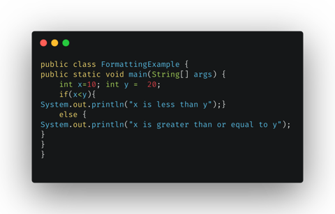
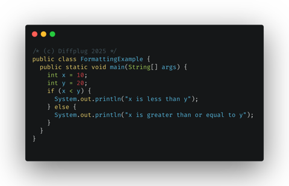

#  Spotless Command Line Interface CLI

_Keep your code Spotless from the command line_

<!---freshmark shields
output = [
  link(shield('Changelog', 'changelog', '{{versionLast}}', 'blue'), 'CHANGES.md'),
  '',
  link(shield('OS Win', 'OS', 'Windows', 'blueviolet'), 'README.md'),
  link(shield('OS Linux', 'OS', 'Linux', 'blueviolet'), 'README.md'),
  link(shield('OS macOS', 'OS', 'macOS', 'blueviolet'), 'README.md'),
  ].join('\n')
-->

[](CHANGES.md)

[](README.md)
[](README.md)
[](README.md)

<!---freshmark /shields -->

`spotless` is a command line interface (CLI) for the [spotless code formatter](../README.md).
It intends to be a simple alternative to its siblings: the plugins for [gradle](../plugin-gradle/README.md), [maven](../plugin-maven/README.md)
and others.

Example usage:

```shell
spotless --target '**/src/**/*.java' \
    google-java-format \
    license-header --header='/* (c) Diffplug $YEAR */'
```

This command formats all java files in any `src` folder with the [google-java-format](https://github.com/google/google-java-format) and adds (or updates an existing) license header.

Using the above command line you go

<!---freshmark example_usage_before_after
output = [
  '| From this | to this |',
    '| --- | --- |',
  '| ' + image('before', 'docs/examples/intro/resized/FormattingExample.java.png') + ' | ' + image('after', 'docs/examples/intro/resized/FormattingExampleFormatted.java.png') + ' |',
  ].join('\n')
-->

| From this                                                         | to this                                                                   |
| ----------------------------------------------------------------- | ------------------------------------------------------------------------- |
|  |  |

<!---freshmark /example_usage_before_after -->

## Installation

To install with Homebrew on macOS or Linux:

```shell
brew install ...
```

To install with Chocolatey on Windows:

```shell
choco install ...
```

Alternatively, you can download the latest binary for your system from the [releases page](https://...) and add it to your PATH.

## Usage

### Available Formatter Steps

#### google-java-format

<!---freshmark gjfshields
output = [
  link(shield('Google Java Format version', 'google-java-format', '{{libs.versions.native.include.googleJavaFormat}}', 'blue'), 'https://github.com/google/google-java-format'),
  ].join('\n')
-->

[](https://github.com/google/google-java-format)

<!---freshmark /gjfshields -->

- TODO: add usage and examples
- TBD: can usage be generated automatically e.g. via freshmark?
-
