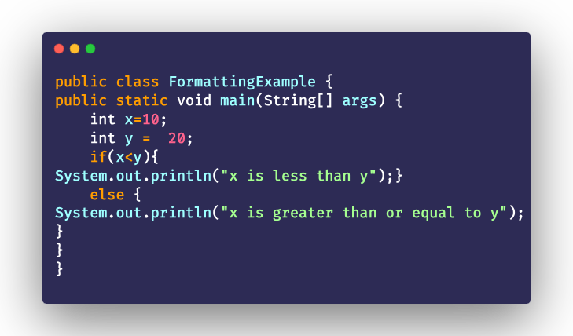
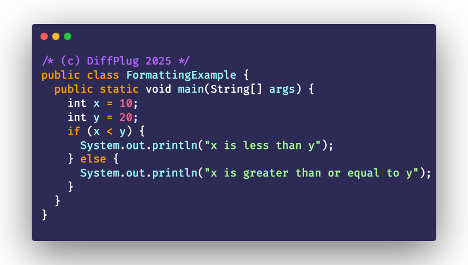

#  Spotless Command Line Interface CLI

_Keep your code Spotless from the command line_

<!---freshmark shields
output = [
  link(shield('Changelog', 'changelog', '{{versionLast}}', 'blue'), 'CHANGES.md'),
  '',
  link(shield('OS Win', 'OS', 'Windows', 'blueviolet'), 'README.md'),
  link(shield('OS Linux', 'OS', 'Linux', 'blueviolet'), 'README.md'),
  link(shield('OS macOS', 'OS', 'macOS', 'blueviolet'), 'README.md'),
  ].join('\n')
-->

[](CHANGES.md)

[](README.md)
[](README.md)
[](README.md)

<!---freshmark /shields -->

> [!NOTE]
> This project is a work in progress :hourglass_flowing_sand: and not yet released.
>
> Please check back later for the first release. :heart:

`spotless` is a command line interface (CLI) for the [spotless code formatter](../README.md).
It intends to be a simple alternative to its siblings: the plugins for [gradle](../plugin-gradle/README.md), [maven](../plugin-maven/README.md)
and others. It supports formatting a plethora of file types and can be easily configured.

Example usage:

```shell
spotless --target '**/src/**/*.java' \
    google-java-format \
    license-header --header='/* (c) DiffPlug $YEAR */'
```

This command formats all java files in any `src` folder with the [google-java-format](https://github.com/google/google-java-format) and adds (or updates an existing) license header.

Using the above command line you go

<!---freshmark example_usage_before_after
output = [
  '| From this | to this |',
    '| --- | --- |',
  '| ' + image('before', 'docs/examples/intro/FormattingExample.png') + ' | ' + image('after', 'docs/examples/intro/FormattingExampleFormatted.png') + ' |',
  ].join('\n')
-->

| From this                                            | to this                                                      |
| ---------------------------------------------------- | ------------------------------------------------------------ |
|  |  |

<!---freshmark /example_usage_before_after -->

## Installation

To install with Homebrew on macOS or Linux:

```shell
brew install diffplug/tap/spotless-cli

# or if you prefer
brew tap diffplug/tap
brew install spotless-cli
```

To install with Chocolatey on Windows:

```shell
choco install ...
```

Alternatively, you can download the latest binary for your system from the [releases page](https://...) and add it to your PATH.

## General usage

The general principle is to specify the files to format, configure global options and then add one or more formatter steps - with configuration if needed.

```shell
# general structure of the invocation
spotless --target [... more options] formatter1 [config-of-formatter1] formatter2 [config-of-formatter2] ...
```

Be aware that the order of the formatter steps is important. The formatters are applied in the order they are specified.

To see all available options and formatters, run:

```shell
spotless --help
```

This will show you the available options and formatters as such:

<!---freshmark usage_main
output =
   '```\n' +
   {{usage.main.array}}.join('\n') +
    '\n```';
-->

```
                     __  __
   _________  ____  / /_/ /__  __________
  / ___/ __ \/ __ \/ __/ / _ \/ ___/ ___/
 (__  ) /_/ / /_/ / /_/ /  __(__  |__  )
/____/ .___/\____/\__/_/\___/____/____/   Spotless CLI
    /_/


Usage: spotless [-hV] [-e=<encoding>] [-l=<lineEnding>] [--log-file=<logFile>]
                [-m=<spotlessMode>] [-p=N] [-t=<targets>]... [-q | -v [-v]...]
                [FORMATTING_STEPS]

spotless is a command line interface (CLI) for the spotless code formatter.
It can either check if your files are formatted according to your configuration
or apply the formatting to the files.

  -e, --encoding=<encoding>  The encoding of the files to format.
                             (default: UTF-8)
  -h, --help                 Show this help message and exit.
  -l, --line-ending=<lineEnding>
                             The line ending of the files to format.
                             One of: GIT_ATTRIBUTES,
                               GIT_ATTRIBUTES_FAST_ALLSAME, PLATFORM_NATIVE,
                               WINDOWS, UNIX, MAC_CLASSIC, PRESERVE
                             (default: UNIX)
      --log-file=<logFile>   The log file to write the output to.
  -m, --mode=<spotlessMode>  The mode to run spotless in.
                             One of: CHECK, APPLY
                             (default: APPLY)
                             APPLY: Apply the correct formatting where needed
                               (replace file contents with formatted content).
                             CHECK: Check if the files are formatted or show
                               the diff of the formatting.
  -p, --parallelity=N        The number of parallel formatter threads to run.
                             (default: #cores * 0.5)
  -q, --quiet                Disable as much output as possible.
  -t, --target=<targets>     The target files to format. Blobs are supported.
                             Examples:
                             -t 'src/**/*.java'
                             -t 'src/**/*.kt'
                             -t 'README.md'
  -v                         Enable verbose output. Multiple -v options
                               increase the verbosity (max 5).
  -V, --version              Print version information and exit.

Available formatting steps:
  license-header      Runs license header
  google-java-format  Runs google java format
  prettier            Runs prettier, the opinionated code formatter.

Possible exit codes:
  0    Successful formatting.
       In APPLY mode, this means all files were formatted successfully.
       In CHECK mode, this means all files were already formatted properly.
  1    Some files need to be formatted.
       In APPLY mode, this means some files failed to be formatted (see output
         for details).
       In CHECK mode, this means some files are currently not formatted
         properly (and might be fixed in APPLY mode).
  -1   Some files did not converge. This can happen when one formatter does not
         converge on the file content.
       You can find more about this special case here:
         <https://github.com/diffplug/spotless/blob/main/PADDEDCELL.md>
  -2   An exception occurred during execution.
```

<!---freshmark /usage_main -->

## Available Formatter Steps

Spotless CLI supports the following formatter steps in alphabetical order:

- [google-java-format](#google-java-format)
- [license-header](#license-header)
- [prettier](#prettier)

### google-java-format

<!---freshmark gjfshields
output = [
  link(shield('Google Java Format version', 'google-java-format', '{{libs.versions.native.include.googleJavaFormat}}', 'blue'), 'https://github.com/google/google-java-format'),
  ].join('\n')
-->

[](https://github.com/google/google-java-format)

<!---freshmark /gjfshields -->

Formats Java files according to the [google-java-format](https://github.com/google/google-java-format) style guide.

To see usage instructions for the google-java-format formatter, run: `spotless google-java-format --help`

<!---freshmark usage_google_java_format
output =
   '```\n' +
   {{usage.google-java-format.array}}.join('\n') +
    '\n```';
-->

```
Usage: spotless google-java-format [-hijrV] [-s=<style>]
Runs google java format
  -h, --help              Show this help message and exit.
  -i, --reorder-imports   Reorder imports.
                          (default: false)
  -j, --format-javadoc    Format javadoc.
                          (default: true)
  -r, --reflow-long-strings
                          Reflow long strings.
                          (default: false)
  -s, --style=<style>     The style to use for the google java format.
                          One of: AOSP, GOOGLE
                          (default: GOOGLE)
  -V, --version           Print version information and exit.
```

<!---freshmark /usage_google_java_format -->

Example usage:

```shell
spotless --target '**/src/**/*.java' google-java-format --reorder-imports=true
```

### license-header

Add or update a license header to the files.

To see usage instructions for the license-header formatter, run: `spotless license-header --help`

<!---freshmark usage_license_header
output =
   '```\n' +
   {{usage.license-header.array}}.join('\n') +
    '\n```';
-->

```
Usage: spotless license-header [-hV] [-c=<contentPattern>] [-d=<delimiter>]
                               [-m=<yearMode>] [-s=<skipLinesMatching>]
                               [-Y=<yearSeparator>] (-H=<header> |
                               -f=<headerFile>)
Runs license header
  -c, --content-pattern=<contentPattern>
                          The pattern to match the content of the file before
                            inserting the licence header. (If the file content
                            does not match the pattern, the header will not be
                            inserted/updated.)
  -d, --delimiter=<delimiter>
                          The delimiter to use for the license header. If not
                            provided, the delimiter will be guessed based on
                            the first few files we find. Otherwise, 'java' will
                            be assumed.
  -f, --header-file=<headerFile>
                          The license header content in a file to apply.
                            May contain $YEAR as placeholder.
  -h, --help              Show this help message and exit.
  -H, --header=<header>   The license header content to apply. May contain
                            $YEAR as placeholder.
  -m, --year-mode=<yearMode>
                          How and if the year in the copyright header should be
                            updated.
                          One of: PRESERVE, UPDATE_TO_TODAY, SET_FROM_GIT
                          (default: PRESERVE)
  -s, --skip-lines-matching=<skipLinesMatching>
                          Skip lines matching the given regex pattern before
                            inserting the licence header.
  -V, --version           Print version information and exit.
  -Y, --year-separator=<yearSeparator>
                          The separator to use for the year range in the
                            license header.
                          (default: -)
```

<!---freshmark /usage_license_header -->

Example usage:

```shell
spotless --target '**/src/**/*.java' license-header --header='/* (c) DiffPlug $YEAR */'
```

### prettier

<!---freshmark prettiershields
output = [
  link(shield('Default prettier version', '(default)-prettier', '{{libs.versions.bundled.prettier}}', 'blue'), 'https://www.npmjs.com/package/prettier/v/{{libs.versions.bundled.prettier}}'),
  ].join('\n')
-->

[](https://www.npmjs.com/package/prettier/v/2.8.8)

<!---freshmark /prettiershields -->

[Prettier](https://prettier.io/) is an opinionated code formatter that supports many languages. Some are supported out of the box such as
JavaScript, JSX, Angular, Vue, Flow, TypeScript, CSS, Less, SCSS, HTML, Ember/Handlebars, JSON, GraphQL, Markdown and YAML.

Even more languages can be supported by including [prettier-plugins](https://prettier.io/docs/plugins).

> [!IMPORTANT]
> Running a prettier formatter step requires a working installation of [Node.js](https://nodejs.org/en/) and [npm](https://www.npmjs.com/).

To see usage instructions for the prettier formatter, run: `spotless prettier --help`

<!---freshmark usage_prettier
output =
   '```\n' +
   {{usage.prettier.array}}.join('\n') +
    '\n```';
-->

```
Usage: spotless prettier [-hV] [-C=<npmInstallCacheDir>]
                         [-n=<explicitNpmExecutable>]
                         [-N=<explicitNodeExecutable>]
                         [-P=<prettierConfigPath>] [-R=<explicitNpmrcFile>]
                         [-A=<additionalNpmrcLocations>]...
                         [-c='OPTION=VALUE']... [-D='PACKAGE=VERSION']...
Runs prettier, the opinionated code formatter.
  -A, --additional-npmrc-location=<additionalNpmrcLocations>
                  Additional locations to search for .npmrc files.
  -c, --prettier-config-option='OPTION=VALUE'
                  A prettier configuration options.
                  The format is 'OPTION=VALUE'.
                  example: 'printWidth=80'
  -C, --npm-install-cache-dir=<npmInstallCacheDir>
                  The directory to use for caching libraries retrieved by 'npm
                    install'.
  -D, --dev-dependency='PACKAGE=VERSION'
                  An entry to add to the package.json for running prettier.
                  The format is 'PACKAGE=VERSION'.
                  example: 'prettier=2.8.7'
  -h, --help      Show this help message and exit.
  -n, --npm-exec=<explicitNpmExecutable>
                  The explicit path to the npm executable.
  -N, --node-exec=<explicitNodeExecutable>
                  The explicit path to the node executable.
  -P, --prettier-config-path=<prettierConfigPath>
                  The path to the prettier configuration file.
  -R, --npmrc-file=<explicitNpmrcFile>
                  The explicit path to the .npmrc file.
  -V, --version   Print version information and exit.
```

<!---freshmark /usage_prettier -->

Example usage:

```shell
spotless --target '**/*.json' prettier

# or using a custom version and plugin (prettier <= 2)
spotless --target='src/**/*.java' prettier \
    --prettier-config-option='printWidth=120' \
    --dev-dependency='prettier=2.8.7' \
    --dev-dependency='prettier-plugin-java=2.1.0'

# or using a custom version and plugin (prettier 3+)
# → prettier 3 needs you to enable plugins explicitly (see 'plugins' config option)
spotless --target='src/**/*.java' prettier \
    --prettier-config-option='printWidth=120' \
    --prettier-config-option='plugins=["prettier-plugin-java"]' \
    --dev-dependency='prettier=3.0.3' \
    --dev-dependency='prettier-plugin-java=2.3.0'
```

## Tipps & Tricks

### Using a configuration file

Since spotless-cli is based on `picocli`, you can use configuration files to store long or complex command lines
(called @files in picocli terminology).

:point_right: For details see [picocli documentation](https://picocli.info/#AtFiles)

Example usage:

Store a configuration file `/path/to/my/project/spotless-prettier-java.config` with the following content:

```
--target 'src/**/*.java'
prettier
--prettier-config-option 'printWidth=120'
--prettier-config-option 'plugins=["prettier-plugin-java"]'
--dev-dependency 'prettier=3.0.3'
--dev-dependency 'prettier-plugin-java=2.3.0'
license-header
--header-file=/path/to/my/project/license-header.txt
```

Then you can run spotless-cli with just the following command:

```shell
spotless @/path/to/my/project/spotless-prettier-java.config
```

which behind the scenes will be expanded into:

```shell
spotless --target='src/**/*.java' \
    prettier \
        --prettier-config-option='printWidth=120' \
        --prettier-config-option='plugins=["prettier-plugin-java"]' \
        --dev-dependency='prettier=3.0.3' \
        --dev-dependency='prettier-plugin-java=2.3.0' \
    license-header \
        --header-file='/path/to/my/project/license-header.txt'
```
